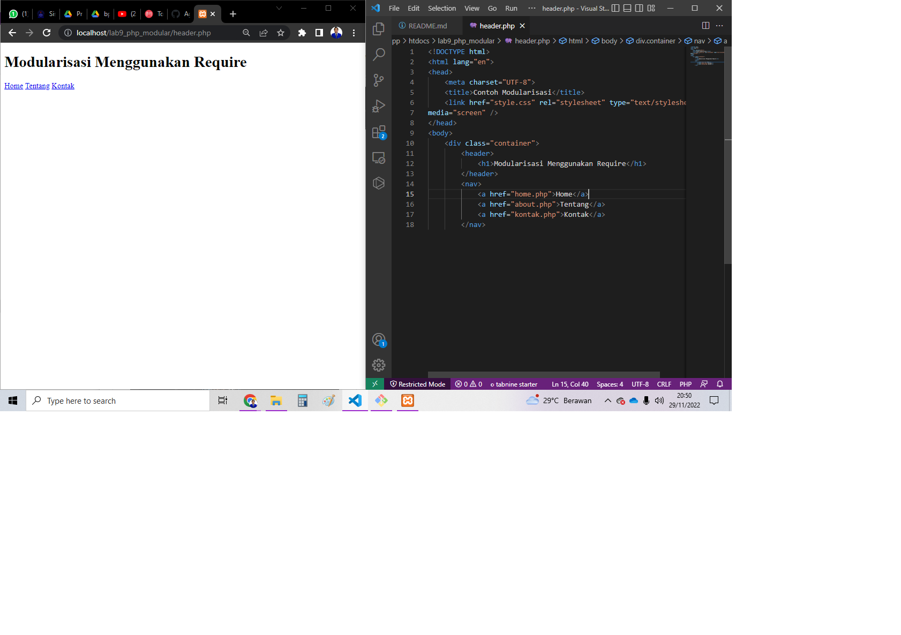
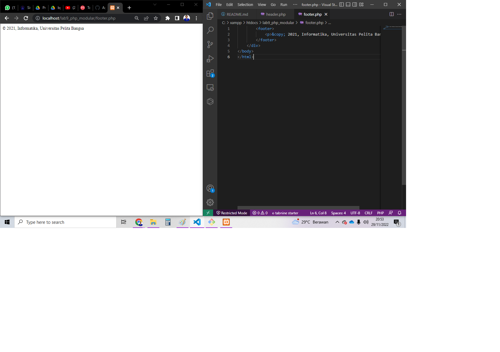
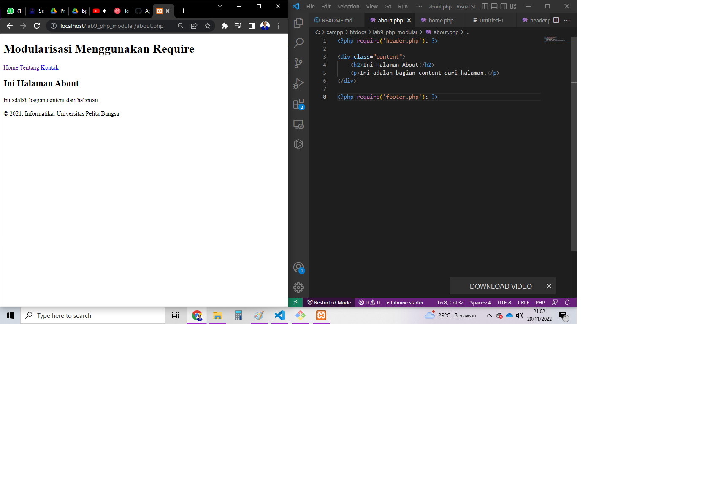

# Praktikum 9: PHP Modular
### Pengertian Modularisasi
• Pembuatan Program dibagi ke dalam beberapa modul.
• Setiap modul dikembangkan untuk tujuan atau fungsi khusus.
• Modul dibuat secara umum (general), dapat berupa fungsi atau
prosedur.
• Mempermudah debugging dan pengembangan program
## Langkah - Langkah Praktikum
### Header.php
Buatlah file baru dengan nama header.php
dan masukan kode berikut :

### footer.php
Buatlah file baru dengan nama footer.php
dan masukan kode berikut :

### home.php
buatlah file baru dengan nama home.php
dan masukan kode berikut :

### about.php
buatlah file baru dengan nama about.php
dan masukan kode berikut :

